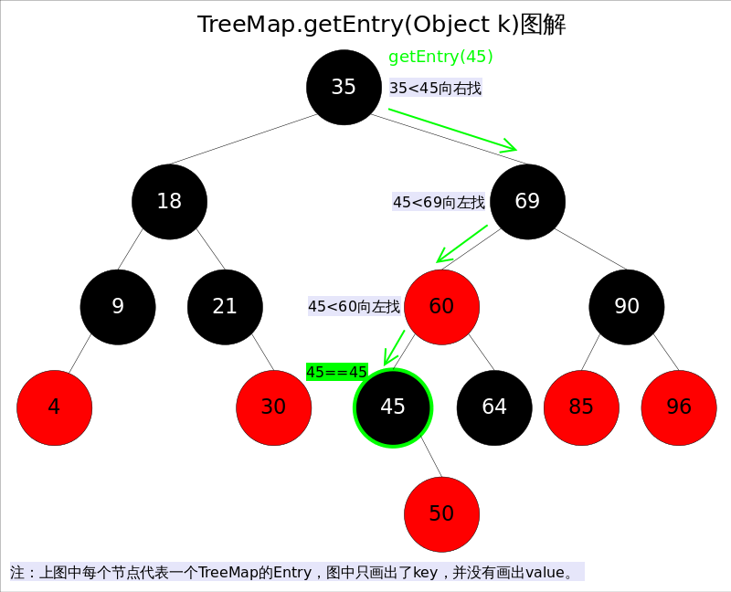
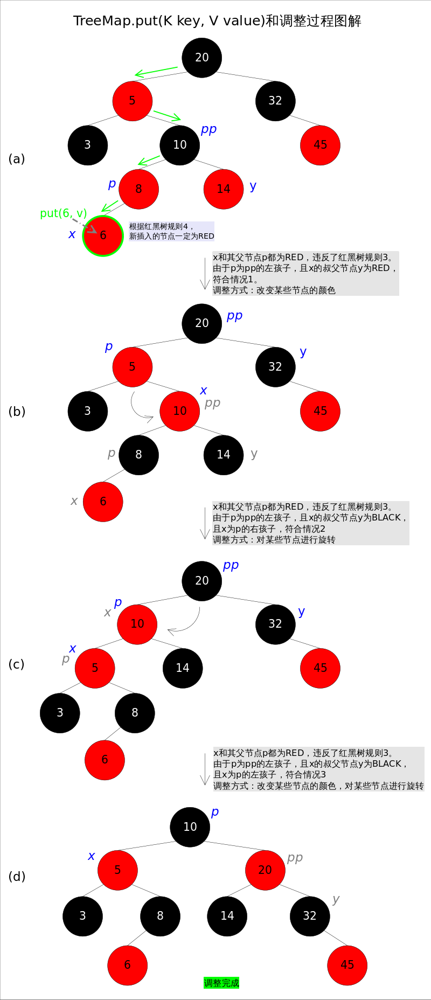

# TreeSet and TreeMap

# 总体介绍

之所以把*TreeSet*和*TreeMap*放在一起讲解，是因为二者在Java里有着相同的实现，前者仅仅是对后者做了一层包装，也就是说***TreeSet*里面有一个*TreeMap*（适配器模式）**。因此本文将重点分析*TreeMap*。

Java *TreeMap*实现了*SortedMap*接口，也就是说会按照`key`的大小顺序对*Map*中的元素进行排序，`key`大小的评判可以通过其本身的自然顺序（natural ordering），也可以通过构造时传入的比较器（Comparator）。

***TreeMap*底层通过红黑树（Red-Black tree）实现**，也就意味着`containsKey()`, `get()`, `put()`, `remove()`都有着`log(n)`的时间复杂度。其具体算法实现参照了《算法导论》。


出于性能原因，*TreeMap*是非同步的（not synchronized），如果需要在多线程环境使用，需要程序员手动同步；或者通过如下方式将*TreeMap*包装成（wrapped）同步的：

`SortedMap m = Collections.synchronizedSortedMap(new TreeMap(...));`

**红黑树是一种近似平衡的二叉查找树，它能够确保任何一个节点的左右子树的高度差不会超过二者中较低那个的一陪**。具体来说，红黑树是满足如下条件的二叉查找树（binary search tree）：

1. 每个节点要么是红色，要么是黑色。
2. 根节点必须是黑色
3. 红色节点不能连续（也即是，红色节点的孩子和父亲都不能是红色）。
4. 对于每个节点，从该点至`null`（树尾端）的任何路径，都含有相同个数的黑色节点。

在树的结构发生改变时（插入或者删除操作），往往会破坏上述条件3或条件4，需要通过调整使得查找树重新满足红黑树的条件。

# 预备知识

前文说到当查找树的结构发生改变时，红黑树的条件可能被破坏，需要通过调整使得查找树重新满足红黑树的条件。调整可以分为两类：一类是颜色调整，即改变某个节点的颜色；另一类是结构调整，集改变检索树的结构关系。结构调整过程包含两个基本操作：**左旋（Rotate Left），右旋（RotateRight）**。

## 左旋

左旋的过程是将`x`的右子树绕`x`逆时针旋转，使得`x`的右子树成为`x`的父亲，同时修改相关节点的引用。旋转之后，二叉查找树的属性仍然满足。


*TreeMap*中左旋代码如下：

```Java
//Rotate Left
private void rotateLeft(Entry<K,V> p) {
    if (p != null) {
        Entry<K,V> r = p.right;
        p.right = r.left;
        if (r.left != null)
            r.left.parent = p;
        r.parent = p.parent;
        if (p.parent == null)
            root = r;
        else if (p.parent.left == p)
            p.parent.left = r;
        else
            p.parent.right = r;
        r.left = p;
        p.parent = r;
    }
}
```

## 右旋

右旋的过程是将`x`的左子树绕`x`顺时针旋转，使得`x`的左子树成为`x`的父亲，同时修改相关节点的引用。旋转之后，二叉查找树的属性仍然满足。


*TreeMap*中右旋代码如下：

```Java
//Rotate Right
private void rotateRight(Entry<K,V> p) {
    if (p != null) {
        Entry<K,V> l = p.left;
        p.left = l.right;
        if (l.right != null) l.right.parent = p;
        l.parent = p.parent;
        if (p.parent == null)
            root = l;
        else if (p.parent.right == p)
            p.parent.right = l;
        else p.parent.left = l;
        l.right = p;
        p.parent = l;
    }
}
```

# 方法剖析

## get()

`get(Object key)`方法根据指定的`key`值返回对应的`value`，该方法调用了`getEntry(Object key)`得到相应的`entry`，然后返回`entry.value`。因此`getEntry()`是算法的核心。算法思想是根据`key`的自然顺序（或者比较器顺序）对二叉查找树进行查找，直到找到满足`k.compareTo(p.key) == 0`的`entry`。



具体代码如下：

```Java
//getEntry()方法
final Entry<K,V> getEntry(Object key) {
    ......
    if (key == null)//不允许key值为null
        throw new NullPointerException();
    Comparable<? super K> k = (Comparable<? super K>) key;//使用元素的自然顺序
    Entry<K,V> p = root;
    while (p != null) {
        int cmp = k.compareTo(p.key);
        if (cmp < 0)//向左找
            p = p.left;
        else if (cmp > 0)//向右找
            p = p.right;
        else
            return p;
    }
    return null;
}
```

## put()

`put(K key, V value)`方法是将指定的`key`, `value`对添加到`map`里。该方法首先会对`map`做一次查找，看是否包含该元组，如果已经包含则直接返回，查找过程类似于`getEntry()`方法；如果没有找到则会在红黑树中插入新的`entry`，如果插入之后破坏了红黑树的约束，还需要进行调整（旋转，改变某些节点的颜色）。

```Java
public V put(K key, V value) {
	......
    int cmp;
    Entry<K,V> parent;
    if (key == null)
        throw new NullPointerException();
    Comparable<? super K> k = (Comparable<? super K>) key;//使用元素的自然顺序
    do {
        parent = t;
        cmp = k.compareTo(t.key);
        if (cmp < 0) t = t.left;//向左找
        else if (cmp > 0) t = t.right;//向右找
        else return t.setValue(value);
    } while (t != null);
    Entry<K,V> e = new Entry<>(key, value, parent);//创建并插入新的entry
    if (cmp < 0) parent.left = e;
    else parent.right = e;
    fixAfterInsertion(e);//调整
    size++;
    return null;
}
```

上述代码的插入部分并不难理解：首先在红黑树上找到合适的位置，然后创建新的`entry`并插入（当然，新插入的节点一定是树的叶子）。难点是调整函数`fixAfterInsertion()`，前面已经说过，调整往往需要1.改变某些节点的颜色，2.对某些节点进行旋转。



调整函数`fixAfterInsertion()`的具体代码如下，其中用到了上文中提到的`rotateLeft()`和`rotateRight()`函数。通过代码我们能够看到，情况2其实是落在情况3内的。情况4～情况6跟前三种情况是对称的，因此图解中并没有画出后三种情况，读者可以参考代码自行理解。

```Java
//红黑树调整函数fixAfterInsertion()
private void fixAfterInsertion(Entry<K,V> x) {
    x.color = RED;
    while (x != null && x != root && x.parent.color == RED) {
        if (parentOf(x) == leftOf(parentOf(parentOf(x)))) {
            Entry<K,V> y = rightOf(parentOf(parentOf(x)));
            if (colorOf(y) == RED) {
                setColor(parentOf(x), BLACK);              // 情况1
                setColor(y, BLACK);                        // 情况1
                setColor(parentOf(parentOf(x)), RED);      // 情况1
                x = parentOf(parentOf(x));                 // 情况1
            } else {
                if (x == rightOf(parentOf(x))) {
                    x = parentOf(x);                       // 情况2
                    rotateLeft(x);                         // 情况2
                }
                setColor(parentOf(x), BLACK);              // 情况3
                setColor(parentOf(parentOf(x)), RED);      // 情况3
                rotateRight(parentOf(parentOf(x)));        // 情况3
            }
        } else {
            Entry<K,V> y = leftOf(parentOf(parentOf(x)));
            if (colorOf(y) == RED) {
                setColor(parentOf(x), BLACK);              // 情况4
                setColor(y, BLACK);                        // 情况4
                setColor(parentOf(parentOf(x)), RED);      // 情况4
                x = parentOf(parentOf(x));                 // 情况4
            } else {
                if (x == leftOf(parentOf(x))) {
                    x = parentOf(x);                       // 情况5
                    rotateRight(x);                        // 情况5
                }
                setColor(parentOf(x), BLACK);              // 情况6
                setColor(parentOf(parentOf(x)), RED);      // 情况6
                rotateLeft(parentOf(parentOf(x)));         // 情况6
            }
        }
    }
    root.color = BLACK;
}
```

## remove()

`remove(Object key)`的作用是删除`key`值对应的`entry`，该方法首先通过上文中提到的`getEntry(Object key)`方法找到`key`值对应的`entry`，然后调用`deleteEntry(Entry<K,V> entry)`删除对应的`entry`。由于删除操作会改变红黑树的结构，有可能破坏红黑树的约束，因此有可能要进行调整。

（TODO：remove(Object key)和调整过程图解）

`getEntry()`函数前面已经讲解过，这里重点放在`deleteEntry()`上。

（TODO：deleteEntry()和fixAfterDeletion()讲解）


