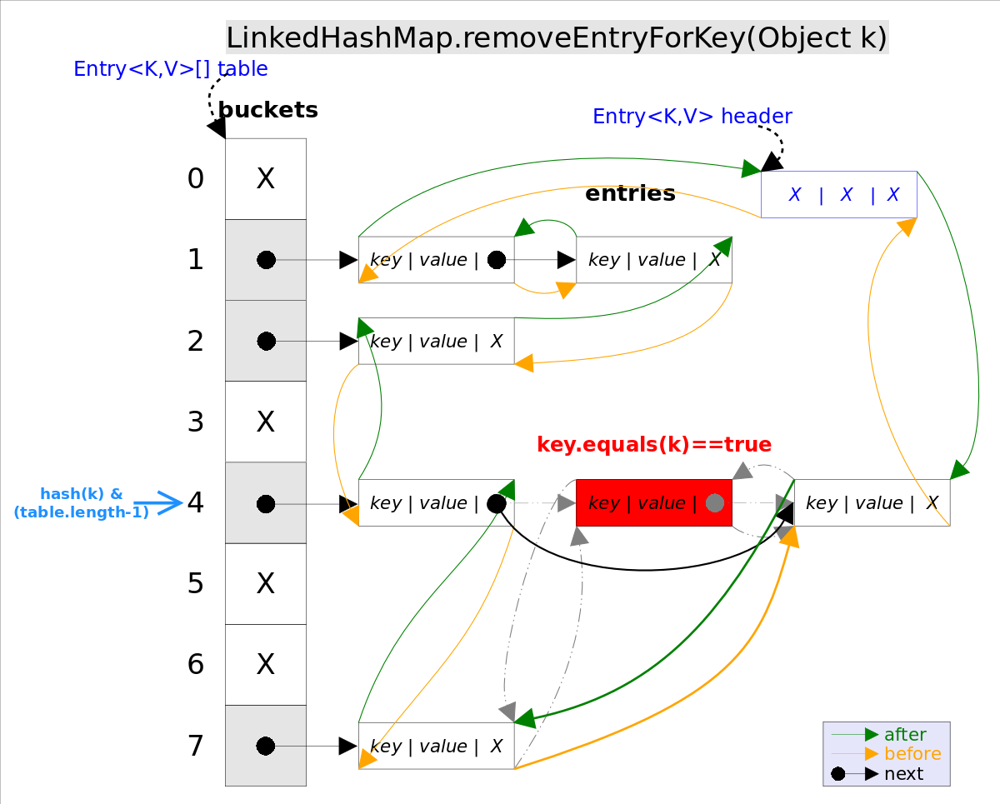

# LinkedHashSet and LinkedHashMap

# 总体介绍

如果你已看过前面关于*HashSet*和*HashMap*，以及*TreeSet*和*TreeMap*的讲解，一定能够想到本文将要讲解的*LinkedHashSet*和*LinkedHashMap*其实也是一回事。*LinkedHashSet*和*LinkedHashMap*在Java里也有着相同的实现，前者仅仅是对后者做了一层包装，也就是说***LinkedHashSet*里面有一个*LinkedHashMap*（适配器模式）**。因此本文将重点分析*LinkedHashMap*。

*LinkedHashMap*实现了*Map*接口，即允许放入`key`为`null`的元素，也允许插入`value`为`null`的元素。从名字上可以看出该容器是*linked list*和*HashMap*的混合体，也就是说它同时满足*HashMap*和*linked list*的某些特性。**可将*LinkedHashMap*看作采用*linked list*增强的*HashMap*。**


事实上*LinkedHashMap*是*HashMap*的直接子类，**二者唯一的区别是*LinkedHashMap*在*HashMap*的基础上，采用双向链表（doubly-linked list）的形式将所有`entry`连接起来，这样是为保证元素的迭代顺序跟插入顺序相同**。上图给出了*LinkedHashMap*的结构图，主体部分跟*HashMap*完全一样，多了`header`指向双向链表的头部（是一个哑元），**该双向链表的迭代顺序就是`entry`的插入顺序**。

除了可以保迭代历顺序，这种结构还有一个好处：**迭代*LinkedHashMap*时不需要像*HashMap*那样遍历整个`table`，而只需要直接遍历`header`指向的双向链表即可**，也就是说*LinkedHashMap*的迭代时间就只跟`entry`的个数相关，而跟`table`的大小无关。

有两个参数可以影响*LinkedHashMap*的性能：初始容量（inital capacity）和负载系数（load factor）。初始容量指定了初始`table`的大小，负载系数用来指定自动扩容的临界值。当`entry`的数量超过`capacity*load_factor`时，容器将自动扩容并重新哈希。对于插入元素较多的场景，将初始容量设大可以减少重新哈希的次数。

将对象放入到*LinkedHashMap*或*LinkedHashSet*中时，有两个方法需要特别关心：`hashCode()`和`equals()`。**`hashCode()`方法决定了对象会被放到哪个`bucket`里，当多个对象的哈希值冲突时，`equals()`方法决定了这些对象是否是“同一个对象”**。所以，如果要将自定义的对象放入到`LinkedHashMap`或`LinkedHashSet`中，需要*@Override*`hashCode()`和`equals()`方法。

通过如下方式可以得到一个跟源*Map* **迭代顺序**一样的*LinkedHashMap*：

```Java
void foo(Map m) {
    Map copy = new LinkedHashMap(m);
    ...
}
```

出于性能原因，*LinkedHashMap*是非同步的（not synchronized），如果需要在多线程环境使用，需要程序员手动同步；或者通过如下方式将*LinkedHashMap*包装成（wrapped）同步的：

`Map m = Collections.synchronizedMap(new LinkedHashMap(...));`

# 方法剖析

## get()

`get(Object key)`方法根据指定的`key`值返回对应的`value`。该方法跟`HashMap.get()`方法的流程几乎完全一样，读者可自行[参考前文](https://github.com/CarpenterLee/JCFInternals/blob/master/markdown/6-HashSet%20and%20HashMap.md#get)，这里不再赘述。

## put()

`put(K key, V value)`方法是将指定的`key, value`对添加到`map`里。该方法首先会对`map`做一次查找，看是否包含该元组，如果已经包含则直接返回，查找过程类似于`get()`方法；如果没有找到，则会通过`addEntry(int hash, K key, V value, int bucketIndex)`方法插入新的`entry`。

注意，这里的**插入有两重含义**：
> 1. 从`table`的角度看，新的`entry`需要插入到对应的`bucket`里，当有哈希冲突时，采用头插法将新的`entry`插入到冲突链表的头部。
> 2. 从`header`的角度看，新的`entry`需要插入到双向链表的尾部。


`addEntry()`代码如下：

```Java
// LinkedHashMap.addEntry()
void addEntry(int hash, K key, V value, int bucketIndex) {
    if ((size >= threshold) && (null != table[bucketIndex])) {
        resize(2 * table.length);// 自动扩容，并重新哈希
        hash = (null != key) ? hash(key) : 0;
        bucketIndex = hash & (table.length-1);// hash%table.length
    }
    // 1.在冲突链表头部插入新的entry
    HashMap.Entry<K,V> old = table[bucketIndex];
    Entry<K,V> e = new Entry<>(hash, key, value, old);
    table[bucketIndex] = e;
    // 2.在双向链表的尾部插入新的entry
    e.addBefore(header);
    size++;
}
```
上述代码中用到了`addBefore()`方法将新`entry e`插入到双向链表头引用`header`的前面，这样`e`就成为双向链表中的最后一个元素。`addBefore()`的代码如下：

```Java
// LinkedHashMap.Entry.addBefor()，将this插入到existingEntry的前面
private void addBefore(Entry<K,V> existingEntry) {
    after  = existingEntry;
    before = existingEntry.before;
    before.after = this;
    after.before = this;
}
```

上述代码只是简单修改相关`entry`的引用而已。

## remove()

`remove(Object key)`的作用是删除`key`值对应的`entry`，该方法的具体逻辑是在`removeEntryForKey(Object key)`里实现的。`removeEntryForKey()`方法会首先找到`key`值对应的`entry`，然后删除该`entry`（修改链表的相应引用）。查找过程跟`get()`方法类似。

注意，这里的**删除也有两重含义**：
> 1. 从`table`的角度看，需要将该`entry`从对应的`bucket`里删除，如果对应的冲突链表不空，需要修改冲突链表的相应引用。
> 2. 从`header`的角度来看，需要将该`entry`从双向链表中删除，同时修改链表中前面以及后面元素的相应引用。



`removeEntryForKey()`对应的代码如下：

```Java
// LinkedHashMap.removeEntryForKey()，删除key值对应的entry
final Entry<K,V> removeEntryForKey(Object key) {
	......
	int hash = (key == null) ? 0 : hash(key);
    int i = indexFor(hash, table.length);// hash&(table.length-1)
    Entry<K,V> prev = table[i];// 得到冲突链表
    Entry<K,V> e = prev;
    while (e != null) {// 遍历冲突链表
        Entry<K,V> next = e.next;
        Object k;
        if (e.hash == hash &&
            ((k = e.key) == key || (key != null && key.equals(k)))) {// 找到要删除的entry
            modCount++; size--;
            // 1. 将e从对应bucket的冲突链表中删除
            if (prev == e) table[i] = next;
            else prev.next = next;
            // 2. 将e从双向链表中删除
            e.before.after = e.after;
            e.after.before = e.before;
            return e;
        }
        prev = e; e = next;
    }
    return e;
}
```

# LinkedHashSet

前面已经说过*LinkedHashSet*是对*LinkedHashMap*的简单包装，对*LinkedHashSet*的函数调用都会转换成合适的*LinkedHashMap*方法，因此*LinkedHashSet*的实现非常简单，这里不再赘述。

```Java
public class LinkedHashSet<E>
    extends HashSet<E>
    implements Set<E>, Cloneable, java.io.Serializable {
    ......
    // LinkedHashSet里面有一个LinkedHashMap
    public LinkedHashSet(int initialCapacity, float loadFactor) {
        map = new LinkedHashMap<>(initialCapacity, loadFactor);
    }
	......
    public boolean add(E e) {//简单的方法转换
        return map.put(e, PRESENT)==null;
    }
    ......
}
```

# LinkedHashMap经典用法

*LinkedHashMap*除了可以保证迭代顺序外，还有一个很有用的用法：可以轻松实现一个采用了FIFO替换策略的缓存。具体说来，LinkedHashMap有一个子类方法`protected boolean removeEldestEntry(Map.Entry<K,V> eldest)`，该方法的作用是告诉Map是否要删除“最老”的Entry，所谓最老就是当前Map中最早插入的Entry，如果该方法返回`true`，最老的那个元素就会被删除。在每次插入新元素的之后LinkedHashMap会自动询问removeEldestEntry()是否要删除最老的元素。这样只需要在子类中重载该方法，当元素个数超过一定数量时让removeEldestEntry()返回true，就能够实现一个使用FIFO策略固定大小的缓存。示例代码如下：

```Java
/** 一个固定大小的FIFO替换策略的缓存 */
class FIFOCache<K, V> extends LinkedHashMap<K, V>{
	private final int cacheSize;
	public FIFOCache(int cacheSize){
    	this.cacheSize = cacheSize; 
    }
    
	// 当Entry个数超过cacheSize时，删除最老的Entry
    @Override
    protected boolean removeEldestEntry(Map.Entry<K,V> eldest) {
       return size() > cacheSize;
    }
}
```


